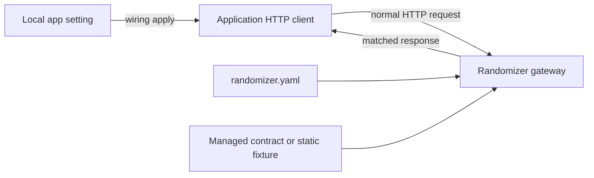

# Project HTTP Mocking

Randomizer project mode serves repository-local HTTP mocks for applications written in any language.
The runtime consumes HTTP routes, JSON contracts, fixtures, and explicit local configuration wiring;
it does not parse source-language DTOs.

## User workflow

Install Randomizer, then run this once from the application repository:

```sh
randomizer init
```

Ask a coding agent for the exact outbound endpoint:

```text
$randomizer-mocks mock GET /users/{user_id}
```

The skill resolves the endpoint and local setting, imports or analyzes an authoritative response
contract, reconciles the route, applies structured local wiring, and verifies the project. Review
the changes, then run:

```sh
randomizer verify --require-managed-contract-route get-user
randomizer start
# Start the application with its normal local command or IDE configuration.
```

Stop the managed background process with `randomizer stop`.

## Repository artifacts

`randomizer init` installs the project layout and repository-local skill:

```text
.randomizer/
├── randomizer.yaml
├── contracts/
├── sources/                  # reviewable schemas assembled from repository evidence
├── fixtures/
├── skills.lock.json
├── contracts.transaction.json # transient recovery journal, normally absent
└── runtime/                    # generated locks/state and gitignored

.agents/skills/randomizer-mocks/
├── SKILL.md
├── agents/openai.yaml
└── references/
    ├── contracts.md
    ├── runtime-capabilities.md
    ├── generic-wire-contract.md
    └── languages/
        ├── java.md
        ├── typescript.md
        ├── python.md
        ├── go.md
        └── rust.md
```

The first managed contract import or analysis also creates
`.randomizer/contracts.lock.json`. Commit the manifest, managed contracts, their source schemas,
sanitized fixtures, contract lock, skill files, skill lock, and safe repository-owned
local-development configuration.
Contract updates use a temporary `.randomizer/contracts.transaction.json` recovery journal and a
process lock; both are gitignored. An interrupted update is restored to its previous artifact and
lock state when the next contract command runs.
If the application's real local file contains secrets or is intentionally ignored, create it through
the repository's normal setup before applying wiring and keep it uncommitted. Do not commit
`.randomizer/runtime/`, secrets, authorization values, personal data, or production payloads.

After installing a newer Randomizer binary, synchronize the managed skill:

```sh
randomizer skill sync
```

Synchronization compares bundled hashes and refuses to replace repository edits unless `--force`
is explicit.

## Language-neutral contract acquisition

Use a committed wire artifact whenever possible. Randomizer supports three built-in import sources.
OpenAPI imports require OpenAPI 3.1 so response schemas use Draft 2020-12 semantics without lossy
3.0 conversion. Standalone schemas must explicitly declare the Draft 2020-12 `$schema`. OpenAPI
documents may use the standard Draft 2020-12 dialect or the default OpenAPI 3.1 base dialect;
custom `jsonSchemaDialect` values are rejected:

```sh
randomizer contract import get-user-200 \
  --source specs/users.schema.json \
  --format json-schema \
  --method GET --endpoint /users/{user_id} --status 200

randomizer contract import get-user-200 \
  --source specs/users.openapi.yaml \
  --format openapi \
  --method GET --endpoint /users/{user_id} --status 200

randomizer contract import get-user-200 \
  --source .randomizer/fixtures/get-user-200.json \
  --format serialized-example \
  --method GET --endpoint /users/{user_id} --status 200
```

The OpenAPI selector must resolve one exact operation and response. It does not guess by operation
name or substitute a request schema. The selected response media type is persisted even when it was
the only choice; the manifest response must emit that type (set its `content-type` header when it is
not `application/json`).

When the authoritative serializer metadata requires language/framework tooling, use an executable
provider supplied by the repository or developer:

```sh
randomizer contract analyze get-user-200 \
  --provider ./tools/randomizer-contract-provider \
  --method GET --endpoint /users/{user_id} --status 200 \
  --root-symbol UserEnvelope \
  --source src/client/user-types.ts
```

Randomizer does not bundle Java, TypeScript, Python, Go, Rust, or other language analyzers. Any
language can integrate through provider protocol version `1`: Randomizer writes one JSON request to
the provider's standard input and reads one JSON response from standard output. The response names
the provider/version and returns a Draft 2020-12 schema, SHA-256 source fingerprints, claim-level
evidence, and structured diagnostics. Every wrapper, property name, type, enum/const, format,
requiredness, nullability, and constraint claim must be evidenced at its exact schema path;
provider-specific generic evidence cannot stand in for it. Randomizer rejects unsupported versions,
invalid schemas, missing fingerprints, error diagnostics, failed processes, oversized output, and
timeouts.
The executable path and provider arguments are persisted verbatim in
`.randomizer/contracts.lock.json` for refreshes, so never pass secrets or tokens through
`--provider-arg`.

Serialized-example import preserves the example and conservatively infers its observed
primitive/container shape plus unambiguous date, date-time, and UUID formats. Warning diagnostics
record that one example cannot prove a complete enum, nullability/optionality across every response,
or unobserved wrapper variants. For an explicitly dynamic route without an upstream schema, the
skill may assemble a reviewable Draft 2020-12 schema in `.randomizer/sources/` by combining those
observations with active serializer configuration, exact source enums, and consumer-side accepted
discriminator/configuration values. Unknown plain strings remain broadly typed; business values are
never invented. An exact fixture is reserved for intentionally static behavior or an explicitly
accepted downgrade.

Managed contracts can be reproduced and audited:

```sh
randomizer contract refresh get-user-200
randomizer contract check get-user-200
randomizer contract check
```

`refresh` reruns the recorded source/provider recipe. `check` is read-only and rejects source,
contract, or lock drift. Imports and analyses update the contract artifact and lock as one
recoverable transaction, so a failed or interrupted two-file update cannot leave accepted split
state.

## Request flow



The application continues making its normal HTTP request. For a service-base target, Randomizer
writes `http://127.0.0.1:7263/mock/<service-id>` to the declared local setting; the remainder of
the request path stays unchanged. When the gateway binds an unspecified address (`0.0.0.0` or
`::`), wiring emits the corresponding loopback address instead of an invalid client destination.

## Manifest

Register services, deterministic wiring, and routes in `.randomizer/randomizer.yaml`:

```yaml
version: 2
project:
  name: garage
  seed: 42
  host: 127.0.0.1
  port: 7263

services:
  - id: users
    wiring:
      - file: .env.local
        format: dotenv
        selector: USERS_API_URL
        target: service_base_url
        service_base_safety: all_calls_mocked
        service_base_path_behavior: preserves_prefix

routes:
  - id: get-user
    service: users
    match:
      method: GET
      path: /users/{user_id}
      query:
        include: details
      headers:
        x-client: garage
    responses:
      - status: 200
        headers:
          x-mock-source: randomizer
        body:
          contract: .randomizer/contracts/get-user-200.json
          mode: valid
        bindings:
          - target: /id
            source: ${request.path.user_id}
            coerce: integer
      - status: 503
        body:
          inline:
            code: temporarily_unavailable
```

Route paths support literal segments, `{name}` parameters, and `*` wildcard segments. Matchers may
also require exact query values, case-insensitive header names with exact values, and request-body
values keyed by JSON Pointer. Paths never contain a query string or fragment; put query requirements
under `match.query`.

Each response body uses one source:

- `inline`: intentionally fixed JSON in the manifest;
- `fixture`: a sanitized JSON file relative to the project root;
- `contract`: a managed or legacy bare Draft 2020-12 response schema.

Multiple responses advance in order and then hold the final response. `randomizer reset` returns
every route to its first response and clears request history.

Bindings replace an existing response JSON Pointer using:

- `${request.path.<name>}`
- `${request.query.<name>}`
- `${request.header.<name>}`
- `${request.body./json/pointer}`

Path, query, and header values are strings by default. Add `coerce: integer` when the response
contract requires an integer, such as a numeric path ID. Coercion is strict and rejects invalid or
out-of-range values. Contract responses are validated again after bindings are applied.

## Local application wiring

Structured wiring makes the application endpoint update deterministic for both new and existing
services:

| `format` | `selector` |
| --- | --- |
| `dotenv` | Exact environment key, for example `USERS_API_URL` |
| `properties` | Exact property key, for example `clients.users.base-url` |
| `json` | RFC 6901 JSON Pointer, for example `/clients/users/baseUrl` |
| `yaml` | Dot path, for example `clients.users.base-url` |

Each entry names an existing project-relative local configuration file and an existing string value.
`target: service_base_url` writes the service gateway prefix and requires an explicit
`service_base_safety` assertion: `dedicated_setting` when the setting is used only by modeled mock
calls, or `all_calls_mocked` when every call sharing it has a Randomizer route. It also requires
`service_base_path_behavior: preserves_prefix`, which may be asserted only after inspecting or
testing the application's actual HTTP client and confirming that resolving its endpoint path keeps
the configured `/mock/<service-id>` prefix, including when the endpoint begins with `/`.
`target: route_url` instead requires a static-path `route` belonging to that service and must omit
both assertions. Paths containing `{parameter}` or `*` cannot be written as usable literal
configuration URLs and are rejected.

```yaml
wiring:
  - file: config/local.json
    format: json
    selector: /clients/users/listUsersUrl
    target: route_url
    route: list-users # matcher path: /users
```

Apply and check all entries or one service:

```sh
randomizer wiring apply
randomizer wiring check
randomizer wiring apply --service users
randomizer wiring check --service users
```

Randomizer rejects paths outside the project, missing or duplicate selectors, mixed formats for one
file, paths under `.randomizer/`, non-string values, dynamic `route_url` paths, and route/service
mismatches. It validates and
snapshots every selected file before writing; if a later replacement fails, prior replacements are
rolled back. It edits only the explicitly declared local files. The older optional `config_key`
service field remains valid as descriptive compatibility
metadata, but it is not a substitute for deterministic `wiring`. Randomizer continues to read
legacy version 1 manifests without wiring. Before adding `wiring` to one, change `version` to `2`;
this lets older binaries reject the new shape with a clear unsupported-version error.

The gateway has no automatic passthrough. If multiple outbound calls share one base URL, applying
`service_base_url` sends all of them to Randomizer and unmatched calls fail. Model every call that
shares the setting, or use `route_url` when the application already exposes a route-specific local
setting for a static path. Do not silently rewrite production configuration.

## Managed response contracts

Contract commands write the existing `JsonSchemaContract` envelope:

```json
{
  "name": "get-user-200",
  "version": "1",
  "source": "specs/users.schema.json",
  "schema": {
    "$schema": "https://json-schema.org/draft/2020-12/schema",
    "type": "object",
    "required": ["id", "status", "created_at"],
    "properties": {
      "id": { "type": "string" },
      "status": { "type": "string", "enum": ["ACTIVE", "SUSPENDED"] },
      "created_at": { "type": "string", "format": "date-time" },
      "message": { "type": ["string", "null"] }
    },
    "additionalProperties": false
  },
  "content_hash": "<canonical-schema-sha256>"
}
```

The envelope makes name, contract version, source provenance, schema, and canonical content hash
explicit. Provider identity/version, invocation recipe, field evidence, diagnostics, and source
fingerprints are recorded separately in `.randomizer/contracts.lock.json`. Existing legacy bare
schemas remain loadable.

Enum values and date/time formats in the example above are valid only when the authoritative source
proves those exact wire encodings. Optional properties stay out of `required`; nullable properties
explicitly include `null`. See the installed skill's `references/contracts.md` for the supported
generation subset and fixture fallbacks.

## Verify and run

```sh
randomizer contract check
randomizer wiring check
randomizer verify --require-managed-contract-route get-user
randomizer start
```

`verify` validates the manifest, checks managed contract freshness and wiring, compiles routes, and
generates/validates contract responses. It also requires every managed contract to be referenced by
a route whose method, path, response status, and effective media type match the locked endpoint.
Check its reported counts against the requested mock: an empty project legitimately reports zero
managed contracts, routes, and wiring entries, so success alone does not establish that an endpoint
was configured. `--require-managed-contract-route` makes that intent executable and may be repeated
for multiple dynamic routes; inline, fixture, unmanaged, and `mode: example` responses do not
satisfy it. Then start the application normally.

Other lifecycle commands:

```sh
randomizer inspect
randomizer status
randomizer reset
randomizer stop
```

Management endpoints:

| Endpoint | Purpose |
| --- | --- |
| `GET /__randomizer/health` | Gateway readiness and route count |
| `GET /__randomizer/routes` | Compiled route IDs |
| `GET /__randomizer/requests` | Recent sanitized request metadata |
| `POST /__randomizer/reset` | Reset response sequences and request history |

## Incremental mock management

The skill identifies an existing route by service, method, normalized path, and distinguishing
matchers. It preserves unrelated services, routes, scenarios, fixtures, contracts, and application
configuration, and repeated invocation must not create duplicates.

For each requested response it records evidence for JSON names, wrappers, primitive/container types,
presence, nullability, enums/constants, formats, and constraints. It reports ambiguity instead of
inventing business states or serialization behavior. This keeps language/framework analysis behind
optional provider boundaries while the Randomizer runtime and project workflow remain universal.
