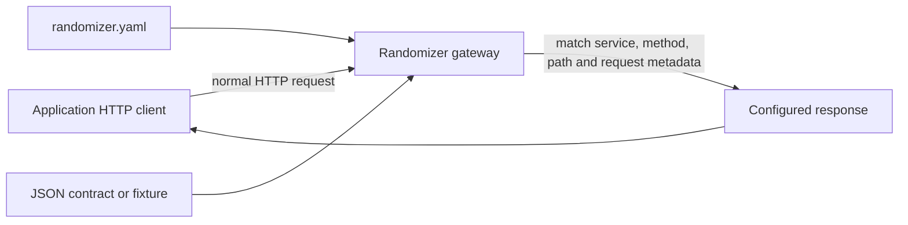

# Project HTTP Mocking

Randomizer project mode serves repository-local HTTP mocks for any application language or
framework. Runtime behavior has no source-analysis, message-broker, container-runtime, Java, or
agent dependency.

## Setup

Run this once from the application repository:

```sh
randomizer init
```

It also creates:

```text
.randomizer/
├── randomizer.yaml
├── contracts/
├── fixtures/
├── skills.lock.json
└── runtime/                 # generated and gitignored

.agents/skills/randomizer-mocks/
├── SKILL.md
├── agents/openai.yaml
└── references/
    ├── contracts.md
    ├── runtime-capabilities.md
    ├── generic-wire-contract.md
    └── languages/
        ├── java.md
        ├── typescript.md
        ├── python.md
        ├── go.md
        └── rust.md
```

Commit the manifest, fixtures, any contracts, the managed skill, `.randomizer/skills.lock.json`, and
the application's local configuration. Do not commit `.randomizer/runtime/`.

Invoke `$randomizer-mocks` whenever one or more endpoints need to be added or updated. The skill
detects the owning language and framework, loads a focused serialization playbook, and inspects only
the requested outbound HTTP clients, response consumers, tests, fixtures, serialized types, service
specifications, enums, booleans, date/time values, and local configuration before reconciling routes
and response contracts. It falls back to a language-neutral wire-contract workflow when no playbook
applies. No manual schema-import command is required. You can also edit the files directly.

After installing a newer Randomizer binary, update the repository copy of the skill:

```sh
randomizer skill sync
```

Randomizer records the hashes and bundled version of managed files. Synchronization preserves local
edits and asks for an explicit `--force` before replacing them.

## Request flow



The application does not send a Randomizer-specific request. Its local base URL points to
`http://127.0.0.1:7263/mock/<service-id>`, and the remainder of the request remains unchanged.

## Manifest

Register services and routes explicitly in `.randomizer/randomizer.yaml`:

```yaml
version: 1
project:
  name: garage
  seed: 42
  host: 127.0.0.1
  port: 7263

services:
  - id: service-os
    config_key: SERVICE_OS_URL

routes:
  - id: get-service-os-task
    service: service-os
    match:
      method: GET
      path: /api/v1/task/{task_id}
      query:
        include: details
      headers:
        x-client: garage
    responses:
      - status: 200
        headers:
          x-mock-source: randomizer
        body:
          inline:
            data:
              reference_id: placeholder
              state: IN_PROGRESS
        bindings:
          - target: /data/reference_id
            source: ${request.path.task_id}
      - status: 503
        body:
          inline:
            code: temporarily_unavailable
```

`config_key` records the local application setting used for the service. Randomizer does not modify
or interpret it at runtime; the `$randomizer-mocks` skill updates the repository's existing local
configuration convention. A service without a `config_key` is valid.

Route paths support literal segments, `{name}` parameters, and `*` wildcard segments. Matchers may
also require exact query values, case-insensitive header names with exact values, and request-body
values keyed by JSON Pointer.

Responses may contain one of:

- `inline`: JSON embedded in the manifest;
- `fixture`: a JSON file relative to the project root;
- `contract`: a bare Draft 2020-12 JSON Schema used for deterministic generation.

Multiple responses advance in order and then hold the final response. `randomizer reset` returns
every route to its first response and clears request history.

Bindings replace an existing response JSON Pointer using:

- `${request.path.<name>}`
- `${request.query.<name>}`
- `${request.header.<name>}`
- `${request.body./json/pointer}`

Contract responses are validated again after bindings are applied.

### Generated response contracts

The skill writes bare schemas under `.randomizer/contracts/`; Randomizer derives contract metadata
and the canonical content hash during verification and runtime:

```json
{
  "$schema": "https://json-schema.org/draft/2020-12/schema",
  "type": "object",
  "required": ["status", "active", "retryable"],
  "properties": {
    "status": { "type": "string", "enum": ["QUEUED", "DONE"] },
    "active": { "type": "boolean" },
    "retryable": { "const": false },
    "message": { "type": ["string", "null"] }
  },
  "additionalProperties": false
}
```

`type: boolean` allows generated `true` and `false` values. Use `const` only when the actual service
contract fixes the flag. Enum values must be exact serialized wire values, including case. Optional
properties stay out of `required`; nullable properties explicitly include `null`.

## Run

Validate configuration first:

```sh
randomizer verify
```

Start Randomizer in the background:

```sh
randomizer start
```

Then start the application with its normal command or IDE. To keep Randomizer attached to the
terminal instead:

```sh
randomizer start --foreground
```

Other lifecycle commands:

```sh
randomizer inspect
randomizer status
randomizer reset
randomizer stop
```

Management endpoints:

| Endpoint | Purpose |
| --- | --- |
| `GET /__randomizer/health` | Gateway readiness and route count |
| `GET /__randomizer/routes` | Compiled route IDs |
| `GET /__randomizer/requests` | Recent sanitized request metadata |
| `POST /__randomizer/reset` | Reset response sequences and request history |

## Incremental mock management

The skill accepts endpoint scope as methods and paths, service names, source files, features,
existing route IDs, or endpoint lists. It identifies existing routes by service, method, normalized
path, and distinguishing matchers so repeated requests do not create duplicates. Unrelated routes,
responses, fixtures, and local configuration remain unchanged.

For response evidence, it prefers developer-provided examples, existing fixtures and tests,
committed OpenAPI or JSON Schema, serialized types and enums, and finally response-consumer
behavior. It records the evidence for each property's JSON name, type, presence, nullability, enum or
constant values, and constraints before creating or updating a contract. Inline bodies are reserved
for intentionally fixed responses; fixtures are used when a supported generated contract cannot
represent the actual response safely.

The skill must not invent business states, error behavior, enum values, secrets, or production
data. When repository evidence is incomplete, it reports the ambiguity and asks for a developer
example. This keeps repository understanding outside the runtime while supporting repeated mock
changes throughout the project lifecycle.
