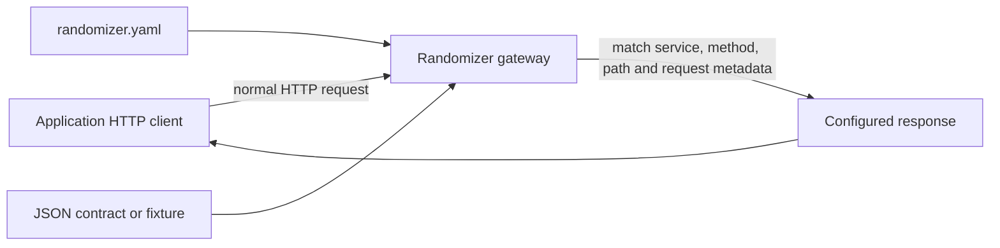

# Project HTTP Mocking

Randomizer project mode redirects selected application HTTP clients to a repository-local mock
gateway. It has no source-code discovery, message-broker, container-runtime, or agent dependency.

## Setup

Run this once from the application repository:

```sh
randomizer init
```

For Spring Boot, initialization adds one import to `application-local.yaml`,
`application-local.yml`, or `application-local.properties`:

```yaml
spring:
  config:
    import: optional:file:.randomizer/runtime/application-randomizer.yaml
```

It also creates:

```text
.randomizer/
├── randomizer.yaml
├── contracts/
├── fixtures/
└── runtime/                 # generated and gitignored
```

Commit the manifest, contracts, fixtures, and local-profile import. Do not commit
`.randomizer/runtime/`.

## Request flow



The application does not send a Randomizer-specific request. Its local base URL points to
`http://127.0.0.1:7263/mock/<service-id>`, and the remainder of the request remains unchanged.

## Manifest

Register services and routes explicitly in `.randomizer/randomizer.yaml`:

```yaml
version: 1
project:
  name: garage
  seed: 42
  host: 127.0.0.1
  port: 7263
  adapter: spring-boot

services:
  - id: service-os
    config_key: url.serviceOSBaseUrl

routes:
  - id: get-service-os-task
    service: service-os
    match:
      method: GET
      path: /api/v1/task/{task_id}
      query:
        include: details
      headers:
        x-client: garage
    responses:
      - status: 200
        headers:
          x-mock-source: randomizer
        body:
          contract: .randomizer/contracts/task-response.json
          mode: valid
        bindings:
          - target: /data/reference_id
            source: ${request.path.task_id}
      - status: 503
        body:
          inline:
            code: temporarily_unavailable
```

Each service `config_key` is written to the generated Spring overlay. A service without a
`config_key` remains available for route validation but does not modify application configuration.

Route paths support literal segments, `{name}` parameters, and `*` wildcard segments. Matchers may
also require exact query values, case-insensitive header names with exact values, and request-body
values keyed by JSON Pointer.

Responses may contain one of:

- `inline`: JSON embedded in the manifest;
- `fixture`: a JSON file relative to the project root;
- `contract`: a JSON Schema used for deterministic generation.

Multiple responses advance in order and then hold the final response. `randomizer reset` returns
every route to its first response and clears request history.

Bindings replace an existing response JSON Pointer using:

- `${request.path.<name>}`
- `${request.query.<name>}`
- `${request.header.<name>}`
- `${request.body./json/pointer}`

Contract responses are validated again after bindings are applied.

## Run

Validate configuration first:

```sh
randomizer verify
```

Run only the gateway:

```sh
randomizer up
```

Or supervise the application too:

```sh
randomizer dev -- mvn spring-boot:run -Dspring-boot.run.profiles=local
```

Other lifecycle commands:

```sh
randomizer inspect
randomizer status
randomizer reset
randomizer down
```

Management endpoints:

| Endpoint | Purpose |
| --- | --- |
| `GET /__randomizer/health` | Gateway readiness and route count |
| `GET /__randomizer/routes` | Compiled route IDs |
| `GET /__randomizer/requests` | Recent sanitized request metadata |
| `POST /__randomizer/reset` | Reset response sequences and request history |

## Java DTO contracts

Phase 1 can compile a standard single-module Maven application and extract a portable JSON Schema
from a Java response DTO. Supply the fully-qualified type and every generic argument:

```sh
randomizer contract import-java \
  --name service-os-task-response \
  --type 'com.acko.garage.integration.centralService.client.ServiceOS.dto.ServiceOSStdResponse<com.acko.garage.integration.centralService.client.ServiceOS.dto.TaskDetailsDTO>'
```

The command uses `mvnw`/`mvnw.cmd` when present and otherwise `mvn`. It compiles the application,
resolves the Maven dependency classpath, loads classes without starting Spring, honors Jackson
property annotations, validates that Randomizer can generate from the schema, and writes:

```text
.randomizer/contracts/service-os-task-response.json
.randomizer/contracts/java.lock.json
```

The exporter is embedded in the Randomizer executable. A JDK 17+ and Maven are the only additional
requirements, and they are normally already present for a Maven application.

Use the generated contract in a route response:

```yaml
body:
  contract: .randomizer/contracts/service-os-task-response.json
  mode: valid
```

All properties are required by default so generated responses contain a useful complete DTO. Use
`--field-presence annotated` when only fields marked with Jackson
`@JsonProperty(required = true)` should be mandatory.

Regenerate registered contracts after DTO changes and check freshness in CI:

```sh
randomizer contract refresh
randomizer contract check
```

`check` recompiles the Maven project and compares transitive application DTO bytecode, the emitted
schema, and the exporter version with the committed lock file. It does not modify contracts.

DTO extraction does not discover HTTP routes. The service, configuration key, method, and path
remain explicit in `randomizer.yaml`; Java response types do not exist in an HTTP request at
runtime. Custom serializers and application-specific `ObjectMapper` modules may require an explicit
fixture or hand-authored schema.
